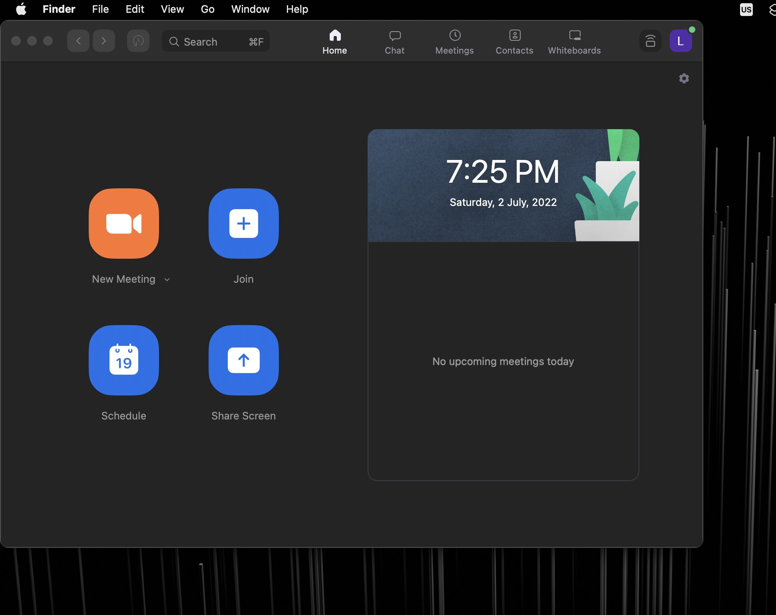

# Autopilot
### Automatically schedule and join Zoom meetings on macOS
By Leonardo - UmActually

Autopilot is kind of late to the party, but it's the solution for the power users who happen to be Zoom users as well. This program uses the [**PyAutoGUI**](https://pypi.org/project/PyAutoGUI/) Python library in order to automate keyboard and mouse input to join a Zoom class or meeting. When installed, you can invoke Autopilot in the **command line** with either `autopilot` or `ap`. The list of all the **arguments** can be found in this README, below.

Autopilot features two primary use cases:
1. Join a meeting **"right now"**.
2. **Schedule** a meeting to join later and, until then, leave the program waiting. Your Mac can be asleep _(Not with the lid closed!)_ during this.

Use case number two enables the user, for example, to leave Autopilot at night and wake up with one task less in their morning routine: Zoom's already open. No need to ask the team or class for the meeting ID this time.

###User-defined schedule

What really makes this a convenient tool is the possibility of building your own schedule for meetings that is automatically saved and repeated on a weekly basis. When you run `autopilot` with no arguments, the program will search and wait for the next meeting in your schedule. Or if you happen to be 10 minutes late to a past meeting, it will immediately join that instead.

```commandline
% autopilot
"Electromagnetism Exam" found in schedule. Wake time: 7/5/2022 11:00:00
Autopilot ready. You can now put your mac to sleep.
Waiting for meeting...
```

To edit the schedule, run `autopilot -c`. This launches the Autopilot config tool. 

```commandline
Electromagnetism Exam

On day(s): Tue
Time: 11:00
Meeting ID: 123456789

[0] Go back, [1] Edit, [2] Delete

Choice? (0-2)
```

### Passing meeting as arguments

If instead the user needs to join a meeting that is not in the schedule, the meeting **ID/link** and optionally the meeting **time** can be passed as **positional args** in any order.

```commandline
% ap 16:00 https://example.zoom.us/j/123456789
Wake time: 7/5/2022 16:00:00
Autopilot ready. You can now put your mac to sleep.
Waiting for meeting...
```

If the time argument is not passed, the meeting will be joined immediately.

```commandline
% ap https://example.zoom.us/j/123456789
Opening zoom: 16:03:34
```

## First use

### Permissions

There are some things to consider and prepare before using Autopilot. For starters, i'd _strongly recommend_ giving the program a **test run** before anything. You can always add the `-t` flag so the command runs in test mode, which stops the program right before the final "join" button in zoom is pressed. However, I recommend testing _while joining a real meeting_ as well. 

In the first use, it is very likely that some functions of the program will throw a macOS confirmation dialog:
- Using **PyAutoGUI** will prompt you to give the Terminal access to accessibility functions, unless access was already given.
- Also, using **AppleScripts** will result in an initial confirmation prompt. 

### Window positioning

In the future, I plan to allow for image searching in order to press the buttons with any window location _(PyAutoGUI makes it very easy)_. But for now, it is necessary for the Zoom **main menu window** to be in the **top-left corner**. The program looks particularly for the orange in the "New Meeting" button, and then uses Command + J to open the join prompt.



### User password

When Autopilot is invoked and will wait for a meeting, the **password** of the user will be prompted. This is necessary to in order to **schedule the display waking** (the `pmset` command needs sudo), and to **log in** once it's awake. You can _disable Ask password_ from the Autopilot config tool by running `autopilot -c`. This way, Autopilot will _no longer ask for the user password_. **However**, if you disable this, you'll need to make sure password isn't prompted when waking your mac: System Preferences > Security & Privacy > Require Password after sleep or screen saver begins (set to the max). You could also use the `caffeinate` command, but I personally wouldn't mess with preventing the computer's sleep.

## Arguments & flags

### Usage

`autopilot [-flags] [time HH:MM] [meeting ID]`

`ap [-flags] [time HH:MM] [meeting ID]`

### Time and meeting ID

These are _optional_ positional argumets. Their order does not matter. If **neither** of them are given, the program will use the **schedule**. If only the **ID** argument is passed, zoom will be opened **immediately** with the given ID or link. It's worthy to note that **time** can be inputted in many ways: `HH:MM`, `H:MM`, or even `H:M` if we can call that a thing. However it _always needs to be written as **24-hour** time_.

### Flags

`-h`, `--help` Display the help message and exit.

`-c`, `--config`, `-s`, `--settings` Change your Autopilot settings or schedule.

`-l`, `--late` Late to class. Join the closest present/past meeting of your schedule, regardless of how much time has passed since. 

`-r`, `--recent` Join the most recent Autpilot-launched meeting.

`-t`, `--test` For testing. Stops right before entering meeting.

`-i`, `--input` Ask for time and ID, rather than using arguments or schedule.

`-q`, `--quiet` Print nothing to the console.

`-v`, `--version` Display program's version number and exit.
